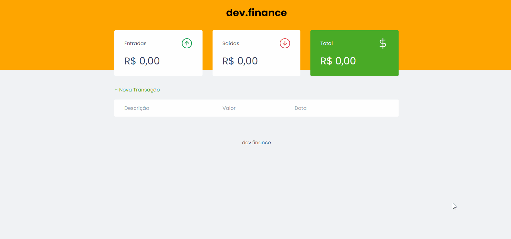

<h1 align="center">
<br>

 <h1 align="center">dev.finance</h1>

<p align="center">
    <b ></b>Uma site criado para fazer a gestão financeira</b>
    <b ></b>totalmente baseado no front-end</b>
</p>

<div align="center" >
    
    </div>

## :bookmark: About

Este é um site que foi desenvolvida na semana Maratona Discover onde estudei conceitos e noções do front-end
Com HTML e CSS + Javascript 

<br>

### Para rodar o site  🚀

#### Cloning

```ps
# Clone o repositório utilizando o git
$ git clone https://github.com/Brenovieira41/dev.finance.git
```
